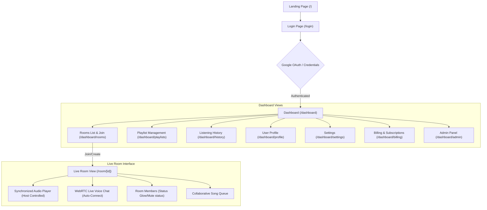

# Syncora Frontend Client 🎨

Syncora is a real-time collaborative music listening and voice communication platform—**"The Discord + Spotify experience for shared emotional listening."**

This directory houses the premium Next.js client application, offering a responsive, high-fidelity user interface built with React, TailwindCSS, Zustand state stores, and Framer Motion.

---

## 🗺️ User Interface Flow

The client is structured to guide users from authentication into a dynamic dashboard, and directly into live sync listening rooms:



---

## ✨ Features & User Experience

*   **Sleek Premium Landing**: An interactive, modern dark-mode aesthetic built with smooth gradients, micro-interactions, and glassmorphism layouts.
*   **Google OAuth Login**: Zero-friction sign-in process supported by NextAuth.js.
*   **Adaptive Listening Room**: A shared audio room featuring:
    *   **Live Playback Sync**: Real-time Socket.io updates keeping tracks synchronized within **150ms** across all listeners.
    *   **Auto-Voice Connect**: WebRTC-powered voice rooms that auto-connect users upon entry with zero friction.
    *   **Speaking Aura Glows**: Real-time microphone input analysis triggers animated glowing avatars for active speakers.
    *   **Drift Correction**: Automatic synchronization checks that re-seek playback timers if drift is detected.
*   **Collaborative Playlists**: Queue tracks, suggest new songs, and build shared listening history in real time.
*   **Payment & Invoicing**: Integrates Stripe and Razorpay checkout frames for easy Premium subscription management.
*   **Moderator Tools**: Dedicated view for flagging toxic behavior or tracking room activities.

---

## 📂 Project Structure

The client directory is structured utilizing Next.js **App Router**:

```txt
frontend/
├── src/
│   ├── app/                    # Next.js App Router Page Tree
│   │   ├── api/                # Internal NextAuth route handlers
│   │   ├── dashboard/          # Dashboard layout & sub-views
│   │   │   ├── admin/          # Admin management dashboards
│   │   │   ├── billing/        # Razorpay/Stripe subscriptions
│   │   │   ├── history/        # User listening logs
│   │   │   ├── playlists/      # Playlist library builder
│   │   │   ├── profile/        # User avatar and credentials edits
│   │   │   ├── rooms/          # Room discovery, creation, and entries
│   │   │   └── settings/       # Notifications and configuration toggles
│   │   ├── login/              # Login authorization page
│   │   ├── room/[id]/          # Dynamic Live Sync listening room
│   │   ├── globals.css         # TailwindCSS core setup & typography
│   │   ├── layout.tsx          # Root HTML structure
│   │   ├── page.tsx            # Premium Landing page
│   │   └── providers.tsx       # React-Query, Auth, and Theme providers
│   ├── hooks/                  # Custom React hooks (sockets, voice streams, player)
│   ├── lib/                    # Configuration (Prisma initialization, API wrappers)
│   └── stores/                 # Zustand global client-side stores
├── public/                     # Icons, static images, and SVG assets
├── eslint.config.mjs           # ESLint configuration parameters
├── tailwind.config.ts          # TailwindCSS configuration
├── next.config.ts              # Next.js compiler parameters
└── package.json                # Frontend package dependencies & scripts
```

---

## 📦 Zustand Stores (State Management)

To maintain clean component code, state is distributed across three lightweight **Zustand** stores in `src/stores/`:

1.  **`authStore.ts`**: Caches active user credentials, email details, role privileges, and billing levels.
2.  **`roomStore.ts`**: Manages room codes, connection states, participant lists (with mute statuses), and whether the current user is designated as the Host.
3.  **`playerStore.ts`**: Houses the active song, play/pause switches, queue arrays, sound volumes, and sync correction offsets.

---

## 🚀 Setup & Local Execution

Follow these steps to configure and run the client-side Next.js app:

### 1. Prerequisites
*   **Node.js** (v18.x or higher)
*   **Google Developer Console Credentials**: Needed for Google OAuth.

### 2. Configure Environment Variables
Create a file named `.env.local` in the `frontend/` directory and populate it with variables:
```bash
NEXT_PUBLIC_BACKEND_URL=http://localhost:3001
NEXT_PUBLIC_APP_URL=http://localhost:3000

# NextAuth Configuration
AUTH_SECRET="your-auth-secret-minimum-32-characters" # openssl rand -base64 32
AUTH_URL=http://localhost:3000

# Google OAuth Keys
AUTH_GOOGLE_ID="your-google-oauth-client-id.apps.googleusercontent.com"
AUTH_GOOGLE_SECRET="GOCSPX-your-google-oauth-client-secret"
```

### 3. Install Dependencies
Run the following inside the `frontend/` directory:
```bash
npm install
```

### 4. Compile database clients
Compile the Prisma schema into the local node_modules directory so standard schema queries function:
```bash
npm run db:generate
```

### 5. Start Development Server
Start the Next.js Turbopack dev server:
```bash
npm run dev
```
Open [http://localhost:3000](http://localhost:3000) to view the application.
